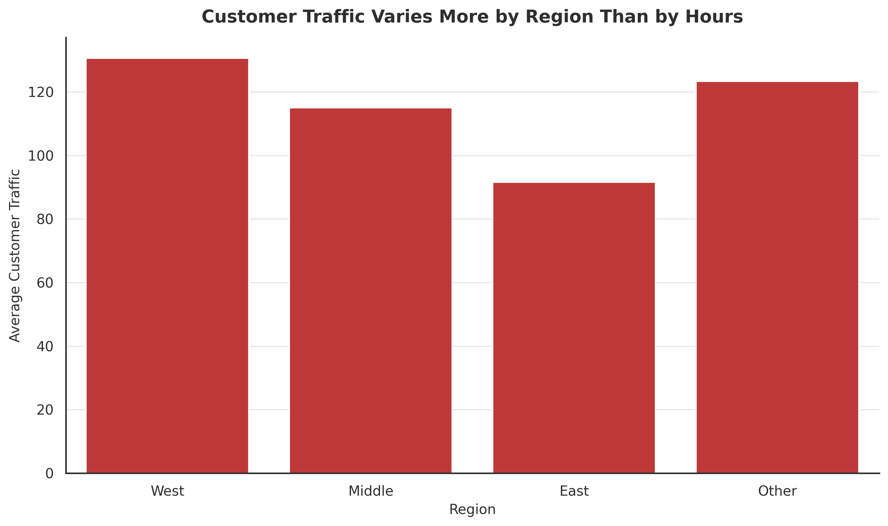
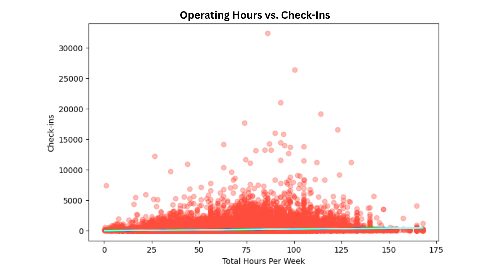
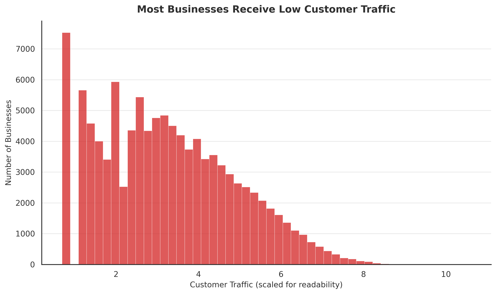
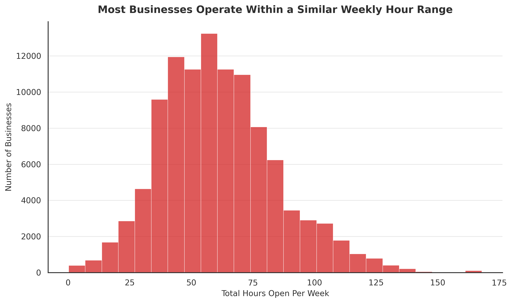
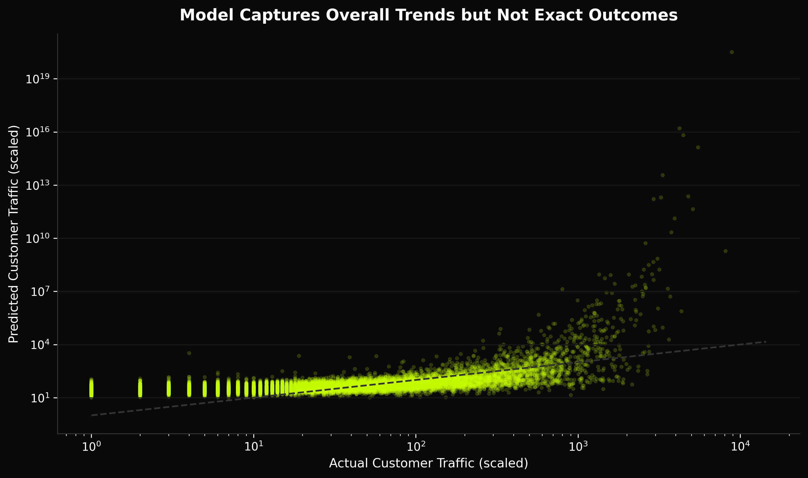

# Do Longer Hours Drive More Foot Traffic?
**Negative Binomial Regression · Yelp Open Dataset · 106,250 businesses**

---

## Overview
Yelp uses business attributes — including operating hours — to rank and recommend businesses to users. This project tested whether operating hours are a reliable predictor of customer foot traffic across 106,250 businesses, and whether they deserve the weight they carry in platform decisions.

Built a fully reproducible pipeline from raw JSON to modeling, controlling for business type, region, ratings, and review volume.

> Full write-up available at [portfolio URL]

---

## Key Findings
- **Operating hours had a statistically significant but negligible effect** on check-ins (β=0.0135, p<.001) — not a reliable signal of which businesses attract more visits
- **Adding controls improved model fit from 0.3% to 12.35%** — business type, region, and review count were far stronger predictors
- **Being a restaurant was a significant predictor** (β=0.1774) — business type matters more than hours
- **Western region businesses averaged 130.6 check-ins versus 91.6 in the East** — regional differences outweigh the impact of operating hours across all models tested

Hours-of-operation data should carry minimal weight in ranking algorithms. Business type, region, and review count are significantly more predictive signals.

---

## Key Visuals

### Customer Traffic Varies More by Region Than by Hours

Western region businesses consistently outperform East and Midwest — regional differences the model explains far better than operating hours alone.

### Longer Operating Hours Do Not Strongly Predict Customer Traffic

The relationship between hours and check-ins is positive but weak — the trend line is nearly flat, which motivated controlling for business type and region in subsequent models.

### Check-In Volume Is Highly Skewed — Why Negative Binomial Over OLS

Check-ins are heavily concentrated among a small number of businesses. This overdispersion makes OLS regression unsuitable — Negative Binomial Regression handles count data with this kind of skew correctly.

### Most Businesses Operate Within a Similar Weekly Hour Range

Operating hours cluster in a mid-range across most businesses — very few operate at the extremes, limiting the variation available to drive meaningful differences in check-in volume.

### Model Captures Overall Trends but Not Exact Outcomes

The model predicts general patterns in check-in volume but cannot precisely predict individual business performance — unobserved factors like marketing spend and local competition also play a role.

---

## Methods
- Data merging and feature engineering from raw Yelp JSON
- Exploratory Data Analysis
- Negative Binomial Regression — chosen over OLS due to count data overdispersion
- Three iterative models: simple GLM, multiple GLM with controls, interaction term model

---

## Tech Stack
Python · Pandas · Statsmodels · Matplotlib · Seaborn

---

## How to Run
```bash
pip install -r requirements.txt
jupyter notebook yelp_checkins_analysis.ipynb
```

---

## Data
**Yelp Open Dataset:** https://www.yelp.com/dataset  
**Kaggle Mirror:** https://www.kaggle.com/datasets/yelp-dataset/yelp-dataset

Download and place the following in your working directory:
- `yelp_academic_dataset_business.json`
- `yelp_academic_dataset_checkin.json`

> Dataset not included in this repo due to file size.

---

## Files
- `yelp_checkins_analysis.ipynb` — full analysis notebook
- `requirements.txt` — dependencies
- `plots/` — generated visualizations
